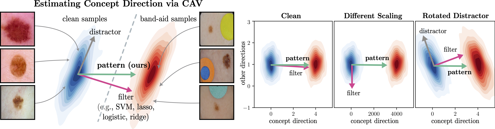

<div align="center">
<h1>Navigating Neural Space: Revisiting Concept Activation Vectors to Overcome Directional Divergence</h1>

[](https://www.python.org/) &nbsp;&nbsp; 
[](https://pytorch.org/)  &nbsp;&nbsp; 
[](https://arxiv.org/abs/2202.03482)
</div>

<div align="center">
    
    <h2>:rocket: To appear at ICLR2025 :rocket:</h2>
</div>


## Description

With a growing interest in understanding neural network prediction strategies, Concept Activation Vectors (CAVs) have emerged as a popular tool for modeling human-understandable concepts in the latent space. Commonly, CAVs are computed by leveraging linear classifiers optimizing the separability of latent representations of samples with and without a given concept. However, in this paper we show that such a separability-oriented computation leads to solutions, which may diverge from the actual goal of precisely modeling the concept direction. This discrepancy can be attributed to the significant influence of distractor directions, i.e., signals unrelated to the concept, which are picked up by filters (i.e., weights) of linear models to optimize class-separability. To address this, we introduce pattern-based CAVs, solely focussing on concept signals, thereby providing more accurate concept directions. We evaluate various CAV methods in terms of their alignment with the true concept direction and their impact on CAV applications, including concept sensitivity testing and model correction for shortcut behavior caused by data artifacts. We demonstrate the benefits of pattern-based CAVs using the Pediatric Bone Age, ISIC2019, and FunnyBirds datasets with VGG, ResNet, and EfficientNet model architectures.

<div align="center">
    
    <p>Pattern-CAVs for precise concept modeling.</p>
</div>


## Table of Contents

- [Description](#description)
- [Table of Contents](#table-of-contents)
- [Installation](#installation)
- [Model Training](#model-training-optional)
- [Preprocessing](#preprocessing)
- [CAV Alignment](#cav-alignment)
- [Model Correction with ClArC](#model-correction-with-clarc)

## Installation

We use Python 3.8.10. To install the required packages, run:

```bash 
pip install -r requirements.txt
```

Secondly, the datasets need to be downloaded. To do so, download and extract the ISIC 2019 dataset using the following:

```bash
mkdir datasets
cd datasets
wget https://isic-challenge-data.s3.amazonaws.com/2019/ISIC_2019_Training_Input.zip
wget https://isic-challenge-data.s3.amazonaws.com/2019/ISIC_2019_Training_GroundTruth.zip
unzip ISIC_2019_Training_Input.zip
unzip ISIC_2019_Training_GroundTruth.zip
```

Then, we need to download the Bone Age Estimation dataset. To do so, run:

```bash
wget https://s3.amazonaws.com/east1.public.rsna.org/AI/2017/Bone+Age+Training+Set.zip
wget https://s3.amazonaws.com/east1.public.rsna.org/AI/2017/Bone+Age+Training+Set+Annotations.zip
unzip Bone+Age+Training+Set.zip
unzip Bone+Age+Training+Set+Annotations.zip
cd ..
```

Lastly, our synthetic FunnyBirds dataset can be downloaded [here](https://drive.google.com/file/d/1_ayNxOA4xz7be6GN3ESypTl-T_jrbSiy/view?usp=sharing).

## Model Training (optional)

Having installed the required packages and datasets,
we can start training the models. 
We use config files to specify the training details, including model, dataset and training parameters.

### Config Files

Config file generatores for training are located in `config_files/training/` and can be run as follows (here for Bone Age):

```bash 
python config_files/training/config_generator_training_bone_attacked.py
```


### Training

Using the previously generated config files, we can train the models by running:

```bash
python -m model_training.start_training --config_file "config_files/training/bone_attacked/your_config_file.yaml"
```

**NOTE**: Models trained for our paper can be downloaded [here](https://drive.google.com/drive/folders/19C7Ancvz_JjuyPr90qP0xhHWRj5br25A?usp=sharing).


## Preprocessing

We precompute latent activations in a preprocessing step, which can be run as follows:
```bash
python -m experiments.preprocessing.run_preprocessing --config_file "config_files/your_config_file.yaml"
```
These precomputed tensors are used to compute CAVs for all our experiments.
Note, that we use WandB to track all our metrics.

## CAV Alignment

To run our CAV alignment experiments, we generate config files using scripts in `config_files/cav_analysis/`.
We can then run the following evalution script to measure the CAV quality in terms of cosine similarity with the ground truth concept direction and AUC to measure the class separability.

```bash
python -m experiments.evaluation.measure_quality_cav_attacked  --config_file "config_files/cav_analysis/bone_attacked/your_config_file.yaml"
```

### TCAV
To compute a concept back (set of CAVs) for our FunnyBirds experiments, run the following script:

```bash
python -m experiments.model_training.train_concept_bank  --config_file "config_files/tcav_experiments/funnybirds_forced_concept/your_config_file.yaml"
```

The TCAV score with respect to these concepts can then be computed with the following code:
```bash
python -m experiments.evaluation.measure_tcav_gt_forced_concepts --config_file "config_files/tcav_experiments/funnybirds_forced_concept/your_config_file.yaml"
```


### Model Correction with ClArC
Lastly, model correction requires scripts to first finetune the model and then evaluate the new model in terms of its sensitivity to the data artifact. Start by generating config files using the generators located in `config_files/clarc_experiments/`.

Then, the model can be finetuned as follows:
```bash
python -m experiments.clarc_experiments.start_model_correction --config_file "config_files/clarc/bone_attacked/your_config_file.yaml"
```

Having finetuned the model we can run evaluations to assess the remaining sensitivity towards the artifact:

```bash
# 1) Evaluate on different subsets (train/val/test) in different settings (clean/biased)
python -m experiments.evaluation.evaluate_by_subset_attacked --config_file "config_files/clarc/bone_attacked/your_config_file.yaml"

# 2) Measure TCAV score using ground truth concept direction
python -m experiments.evaluation.measure_tcav_gt --config_file "config_files/clarc/bone_attacked/your_config_file.yaml"

# 3a) Measure relevance on artifact region in input space
python -m experiments.evaluation.compute_artifact_relevance --config_file "config_files/clarc/bone_attacked/your_config_file.yaml"

# 3b) [for ViT] Measure relevance on artifact region in input space
python -m experiments.evaluation.compute_artifact_relevance_shap --config_file "config_files/clarc/bone_attacked/your_config_file.yaml"
```

Please feel free to cite our work in your research:

```bibtex
@article{pahde2022navigating,
  title={Navigating neural space: Revisiting concept activation vectors to overcome directional divergence},
  author={Pahde, Frederik and Dreyer, Maximilian and Weber, Leander and Weckbecker, Moritz and Anders, Christopher J and Wiegand, Thomas and Samek, Wojciech and Lapuschkin, Sebastian},
  journal={arXiv preprint arXiv:2202.03482},
  year={2022}
}
}
```